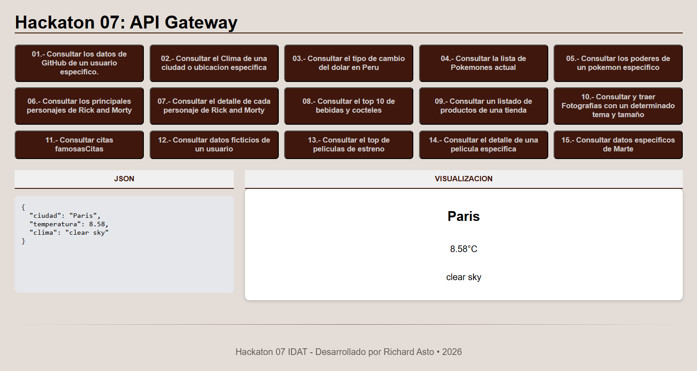

# HACKATHON SEMANAL

## LOGRO: Utilizar NodeJS y API. 

### I.	Es hora de demostrar lo aprendido:
Demostrarás todo lo aprendido en este reto que se basará en las clases dictadas durante la semana.
### II.	Insumos para resolver el Reto:
- Conocimientos adquiridos en las semanas anteriores
- Documentación de las semanas anteriores

### III.	Descripción del reto
- Investigar y resolver las preguntas y ejercicios planteados
- Resolver problemas, definir algoritmos, utilizando las nuevas funcionalidades NodeJS y API

### IV.	Pasos a seguir para resolver los retos: 

- El docente indicará si este reto se resolverá de manera individual o grupal

## Reto 1:

### TÍTULO: NodeJS
Utilizar Javascript para definir algoritmos mediante el uso de clases y objetos
EL PROBLEMA: 
Se necesita programar un **API Gateway**, es decir un programa que devuelva la consulta
centralizada de conexiones API de otras aplicaciones, por lo tanto vamos a realizar una
pagina web en NodeJS que nos ayude a consultar la siguiente lista de API's:

- Consultar los datos de GitHub de un usuario especifico.      
- Consultar el Clima de una ciudad o ubicacion especifica    
- Consultar el tipo de cambio del dolar en Peru              
- Consultar la lista de Pokemones actual                     
- Consultar los poderes de un pokemon especifico             
- Consultar los principales personajes de Rick and Morty     
- Consultar el detalle de cada personaje de Rick and Morty   
- Consultar el top 10 de bebidas y cocteles                  
- Consultar un listado de productos de una tienda            
- Consultar y traer Fotografias con un determinado tema y tamaño  
- Consultar citas famosas    
- Consultar datos ficticios de un usuario  
- Consultar el top de peliculas de estreno   
- Consultar el detalle de una pelicula especifica
- Consultar datos especificos de Marte


Referencias: 

- https://api.github.com/users/rpinedaec83
- https://api.nasa.gov
- https://www.frankfurter.app
- https://pokeapi.co
- https://rickandmortyapi.com
- https://www.thecocktaildb.com
- https://fakestoreapi.com
- https://unsplash.com/developers
- https://quotes.rest
- https://randomuser.me
- https://developer.themoviedb.org/docs


### V.	Solución del reto
- Para que el reto esté cumplido al 100%, se deben haber resuelto el ejercicio propuesto

### VI.	Presentación del Reto
- El documento debe ser presentado de manera individual o grupal (según se coordine con el docente)
- El tiempo de cada presentación lo definirá el docente a cargo

### VII.	Feedback
- El docente dará feedback a los estudiantes sobre los ejercicios realizados

### --------------------------------------------------------------------------------

### Resolucion Ejercicio

### Hackaton 07: API Gateway
- API Gateway que centraliza consultas a múltiples APIs externas desde un frontend HTML/CSS/JS.

## 🚀 Tecnologías

- **Backend:** Node.js + Express
- **HTTP Client:** Axios
- **Variables de entorno:** dotenv
- **Frontend:** HTML, CSS, JavaScript vanilla



## 📁 Estructura

```
├── routes/
│   └── apiRoutes.js
├── services/
│   ├── movieService.js
│   ├── weatherService.js
│   ├── pokemonService.js
│   └── ... (12 servicios)
├── .env
├── server.js
├── style.css
└── index.html
```

## ⚙️ Instalación

```bash
npm install
```

Crea un archivo `.env` en la raíz:

```env
TMDB_KEY=tu_clave_tmdb
UNSPLASH_KEY=tu_clave_unsplash
```

```bash
node server.js
```

Abre `index.html` en el navegador.

## 🔗 Endpoints

| Método | Ruta                            | Descripción                       |
|--------|---------------------------------|-----------------------------------|
| GET    | `/api/github/:username`         | Datos de usuario GitHub           |
| GET    | `/api/clima/:city`              | Clima de una ciudad               |
| GET    | `/api/dolar`                    | Tipo de cambio del dólar en Perú  |
| GET    | `/api/pokemon`                  | Lista de Pokémons                 |
| GET    | `/api/pokemon/:name`            | Detalle de un Pokémon             |
| GET    | `/api/rickmorty`                | Personajes de Rick and Morty      |
| GET    | `/api/cocteles`                 | Top cócteles                      |
| GET    | `/api/productos`                | Productos de tienda               |
| GET    | `/api/fotos/:tema`              | Fotos por tema                    |
| GET    | `/api/cita`                     | Cita famosa aleatoria             |
| GET    | `/api/usuario`                  | Usuario ficticio aleatorio        |
| GET    | `/api/peliculas`                | Top películas en cartelera        |
| GET    | `/api/pelicula/buscar/:nombre`  | Buscar película por nombre        |
| GET    | `/api/marte`                    | Datos de Marte (NASA)             |

---

Hackaton 07 IDAT · Desarrollado por Richard Asto · 2026